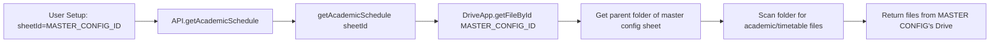

# Academic Schedule Drive File Fetching — Bug Diagnosis & Fix Plan

## 1. Root Cause Bug

**`getAcademicSchedule()`** in [`Central_API.gs:1517-1668`](../google_apps_script/Central_API.gs:1517) uses the **master config spreadsheet's parent folder** to scan for academic/timetable/calendar files, instead of using the **college's own spreadsheet's parent folder**.

### How the bug manifests

```
[User Setup Input]
       |
       v
ACAD_CONFIG.SHEET_ID = "1p3WoC2s-YYqn9ekqkQ72banxAAd-ujlDoFYpv4fkXmk"
  (the master config spreadsheet ID — same for ALL colleges)
       |
       v
API.getAcademicSchedule() → _get('getAcademicSchedule')
       |
       v  (sends ?sheetId=1p3WoC2s-... as parameter)
doGet(e) in Central_API.gs
       |
       v
getAcademicSchedule(sheetId)  ← sheetId = MASTER CONFIG ID
       |
       v
DriveApp.getFileById(realId).getParents()
  → Gets PARENT FOLDER of the master config spreadsheet
  → Scans THAT folder for academic/timetable/calendar files
  → Also does global Drive search for matching files
       |
       v
Returns files from the MASTER CONFIG's Drive folder
     NOT from the college's Drive folder
```

### Comparison: How other functions do it correctly

| Function | Lines | Uses `getTargetSheetIds()`? | Resolves college context? |
|---|---|---|---|
| `getTeachingPlan()` | 921-1166 | ✅ Yes (line 972) | ✅ Targets college `teachingPlanId` |
| `syncTeachingPlan()` | 1168-1437 | ✅ Yes (line 1221) | ✅ Targets college `outputSheetId` |
| `saveRemark()` | 1439-1450 | ✅ Yes (line 1464) | ✅ Targets college `teachingPlanId` |
| `addCustomSyllabusTopic()` | 1454-1515 | ✅ Yes (line 1442) | ✅ Targets college `teachingPlanId` |
| **`getAcademicSchedule()`** | **1517-1668** | **❌ NEVER calls it** | **❌ Uses master config folder** |

## 2. Bug vs Fix Table

| # | Bug Description | Location | Severity | Proposed Fix |
|---|---|---|---|---|
| **B1** | **`getAcademicSchedule()` resolves Drive folder from the master config spreadsheet parent folder instead of the college's spreadsheet parent folder.** It directly uses `sheetId` (the master config ID) as the spreadsheet to locate in Drive, then scans its parent folder for academic files. | [`Central_API.gs:1534-1545`](../google_apps_script/Central_API.gs:1534) | **Critical** | Extract the college-config resolution logic from `getTargetSheetIds()` into a new helper `_getCollegeSheetIds(sheetId)` that does NOT need a `code` parameter. Use the resolved `outputSheetId` or `teachingPlanId` to find the college's spreadsheet, then scan ITS parent folder. |
| **B2** | **Global Drive search hits too broadly.** The function searches entire Drive for folders/files matching "Academic/Timetable/Calendar/Schedule" keywords across all accessible locations, not scoped to the college's Drive. | [`Central_API.gs:1606-1614`](../google_apps_script/Central_API.gs:1606) and [`1622-1649`](../google_apps_script/Central_API.gs:1622) | **High** | After fixing B1 to target the college's folder, restrict global search using a folder-scoped search (e.g., search within the college's folder tree only) or remove the global search entirely since folder-based scanning is sufficient. |
| **B3** | **Root folder fallback is too broad.** If the master config spreadsheet has no parent (edge case), it falls back to `DriveApp.getRootFolder()` — the entire "My Drive" root. | [`Central_API.gs:1547-1557`](../google_apps_script/Central_API.gs:1547) | **Medium** | After fixing B1, the fallback should use the resolved college spreadsheet's parent folder, or return empty results with a clear error message instead of scanning all of Drive. |
| **B4** | **`getAcademicSchedule()` function signature lacks college context.** Unlike all other academic functions that take `(code, teacher, sheetId)` or `(code, sheetId)`, this function only takes `sheetId`. But academic schedule is college-wide (not subject-specific), so it needs a different way to resolve college identity. | [`Central_API.gs:1517`](../google_apps_script/Central_API.gs:1517) and [`js/api.js:181`](../js/api.js:181) and [`js/app.js:1210`](../js/app.js:1210) | **Medium** | The backend should resolve the college's `outputSheetId` from the master config using `sheetId` alone (without needing `code`), since academic schedule is a college-wide concept. No frontend API change needed. |

## 3. Data Flow — Current vs Fixed

### Current (Broken)



### Fixed

```mermaid
flowchart LR
    A[User Setup: sheetId=MASTER_CONFIG_ID] --> B[API.getAcademicSchedule]
    B --> C[getAcademicSchedule sheetId]
    C --> D[_getCollegeSheetIds sheetId]
    D --> E[Look up master config row matching sheetId]
    E --> F[Extract outputSheetId for this college]
    F --> G[DriveApp.getFileById outputSheetId]
    G --> H[Get parent folder of college's output sheet]
    H --> I[Scan folder for academic/timetable files]
    I --> J[Return files from COLLEGE's Drive]
```



## 4. Additional Logic Flaws Found

### F1: Missing `_getCollegeSheetIds()` helper (technical debt)
The college-config lookup logic is duplicated inside `getTargetSheetIds()` but is not reusable by functions that don't have a `code` parameter. A properly extracted `_getCollegeSheetIds(sheetId)` helper that returns `{ outputSheetId, teachingPlanId }` from the master config row would benefit all functions and prevent this class of bug.

**Located at**: [`Central_API.gs:501-543`](../google_apps_script/Central_API.gs:501) (the code is inside `getTargetSheetIds()` but not extracted)

### F2: `getAcademicSchedule()` has no caching
Other endpoints use `_getSpreadsheet()` which caches spreadsheet opens. But the Drive file scanning in `getAcademicSchedule()` performs multiple Drive API calls (`getParents`, `getFolders`, `getFiles`, `searchFiles`) on every invocation. With up to 3 retries from the frontend, this could exhaust Drive quota.

**Located at**: [`Central_API.gs:1517-1668`](../google_apps_script/Central_API.gs:1517) — entire function lacks caching

### F3: Frontend has no fallback if academic schedule data is empty for a college
The frontend [`loadAcademicSchedule()`](../js/app.js:1197) doesn't attempt to distinguish between "college has no Drive folder configured" vs "college has no files yet". The user sees a generic "No Files Found" message with no guidance on configuring their Drive folder.

**Located at**: [`js/app.js:1240-1251`](../js/app.js:1240)

### F4: Hardcoded master config sheet ID in multiple places
The `MASTER_CONFIG_SHEET_ID` is hardcoded as `"1p3WoC2s-YYqn9ekqkQ72banxAAd-ujlDoFYpv4fkXmk"` inside `getTargetSheetIds()` and `getGlobalTeachingPlanLink()`. While not a bug per se, the same ID is also referenced elsewhere, creating a maintenance risk.

**Located at**: [`Central_API.gs:503`](../google_apps_script/Central_API.gs:503) and [`Central_API.gs:598`](../google_apps_script/Central_API.gs:598)

## 5. Proposed Fix Implementation Plan

### Step 1: Extract `_getCollegeSheetIds(sheetId)` helper function
Create a new helper in [`Central_API.gs`](../google_apps_script/Central_API.gs) (around line 495, before `getTargetSheetIds()`):

```javascript
/**
 * Extract college-specific sheet IDs from the master config sheet
 * by matching the sheetId (input sheet ID/URL) row.
 * Returns { outputSheetId, teachingPlanId } or empty strings.
 */
function _getCollegeSheetIds(sheetId) {
  var teachingPlanId = '';
  var outputSheetId = '';
  // ... extract logic from getTargetSheetIds() lines 501-543 ...
  return { outputSheetId: outputSheetId, teachingPlanId: teachingPlanId };
}
```

Then simplify `getTargetSheetIds()` to call this helper first, falling back to the subjects-sheet parsing logic for subject-specific overrides.

### Step 2: Modify `getAcademicSchedule()` to resolve college context
Change the function to:

```javascript
function getAcademicSchedule(sheetId) {
  try {
    var realId = extractSpreadsheetId(sheetId) || sheetId;
    if (!realId) {
      return { success: false, error: "Spreadsheet ID missing." };
    }

    // Resolve college-specific spreadsheet first
    var collegeIds = _getCollegeSheetIds(sheetId);
    var targetSpreadsheetId = collegeIds.outputSheetId || collegeIds.teachingPlanId || realId;
    
    // Use the college's spreadsheet to locate its Drive parent folder
    var parentFolder = null;
    try {
      var files = DriveApp.getFileById(targetSpreadsheetId).getParents();
      if (files.hasNext()) {
        parentFolder = files.next();
      }
    } catch(e) {}
    
    // ... rest of scanning logic remains the same ...
  }
}
```

### Step 3: Scope global search to college's folder
Instead of searching all of Drive, scope the search using `parentFolder.searchFolders()` or `parentFolder.searchFiles()` if possible. Alternatively, remove the global search pass and rely solely on parent-folder scanning to keep results predictable.

### Step 4: Add caching for academic schedule results
Cache the file list in the script's `CacheService` or `PropertiesService` with a 5-minute TTL to reduce Drive API quota usage.

## 6. Files to Modify

| File | Changes |
|---|---|
| [`google_apps_script/Central_API.gs`](../google_apps_script/Central_API.gs) | 1. Add `_getCollegeSheetIds(sheetId)` helper (before line 497)<br>2. Refactor `getTargetSheetIds()` to use the new helper<br>3. Fix `getAcademicSchedule()` to resolve college context<br>4. Scope global search to college's folder<br>5. Add caching for academic schedule |
| [`js/app.js`](../js/app.js) | Optional: Improve "No Files Found" UI with contextual guidance |
