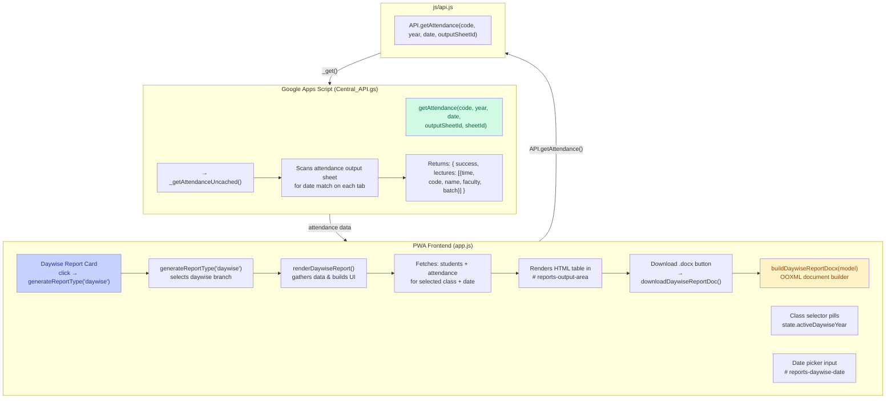
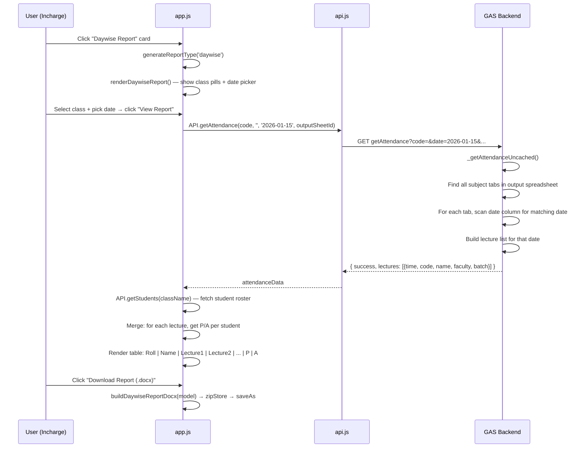

# Plan: Daywise Student Attendance Report

## Problem Statement

Colleges need a "Daywise Student Report" — a single-day attendance snapshot showing **Roll No | Student Name | Lectures Conducted that Day | Present/Absent per Lecture | Totals** — for Academic Incharge use.

---

## Requirements (Confirmed with User)

| Item | Detail |
|------|--------|
| **Report Type** | Single date selection (one specific day) |
| **Table Columns** | Roll No · Student Name · Each lecture column (e.g. 9:00–10:00 SubjectX, 10:00–11:00 SubjectY) · Present Count · Absent Count |
| **Class Selector** | Same pill-button cards as Student-Wise Report (FY/ SY/ TY/ Final Year, etc.) |
| **Placement** | 3rd report card in Academic Reports page (`view-incharge-reports`) |
| **Export** | `.docx` only — with college letterhead, management name, academic year, incharge/principal signature blocks |
| **Access** | Academic Incharge only (already PIN-protected section) |

---

## Architecture



---

## Data Flow



---

## File Changes (by file)

### 1. `app.html`
- Add a 3rd report card in `#reports-cards-container` (lines ~559) after Student card:
  ```html
  <div class="glass-folder-card accent-green report-card-option"
       id="card-report-daywise" onclick="App.generateReportType('daywise')">
    <!-- icon, badge, description -->
  </div>
  ```
- No new views needed — all content renders in `#reports-output-area`

### 2. `js/app.js`
- **`generateReportType(type)`** (~line 4036): Add `else if (type === 'daywise')` branch that calls `renderDaywiseReport()`
- **`renderDaywiseReport()`** (new function): Build class pill selector + date input + "View Report" button + container `<div id="daywise-report-container">`
- **`fetchDaywiseAttendanceData(className, date)`** (new function): Call `API.getAttendance()` for each subject code in the class (or loop over all tabs from dashboard), merge results into lecture list, call `API.getStudents(className)`, then for each lecture call `API.getAttendance(code, year, date)` to get per-student P/A matrix
- **`downloadDaywiseReportDoc()`** (new function): Build docMeta object with college/mgmt/ay/date/class, call `buildDaywiseReportDocx(model)`
- **`buildDaywiseReportDocx(model)`** (new function): OOXML document builder — matches the style of `buildStudentAttendanceDocx` and `buildDefaultersNoticeDocx` — produces a `.docx` with:
  - College header / Management / Academic Year
  - Metadata table: Class, Date, Total Lectures, Total Students
  - Attendance table: Roll No | Name | Lecture slots | P | A
  - Signature block: Academic Incharge, Principal (from `cfg.principalName`)
  - Landscape orientation if many lecture columns
- **Export `downloadDaywiseReportDoc` and `fetchDaywiseAttendanceData`** in the `return { ... }` block (~line 5027)

### 3. `js/api.js` (likely no changes needed)
- `API.getAttendance(code, year, date, outputSheetId)` already exists and is called with date
- Confirm it returns per-student attendance for a given date

---

## Step-by-Step Implementation Tasks

- [ ] **1. HTML**: Add "Daywise Report" card to `app.html` in `#reports-cards-container`
- [ ] **2. JS — UI scaffold**: Add `else if (type === 'daywise')` branch in `generateReportType()` in `app.js`
- [ ] **3. JS — date view**: Implement `renderDaywiseReport()` — renders class pills + date input + "View Report" button + empty container
- [ ] **4. JS — data fetch**: Implement `fetchDaywiseAttendanceData(className, date)` — loops subject codes, calls `API.getAttendance` per subject/date, merges into lecture array, fetches students, builds combined model
- [ ] **5. JS — on-screen table**: Render merged data as HTML table in `#daywise-report-container` with Roll | Name | Lecture columns | P | A, with color coding (green P, red A)
- [ ] **6. JS — docx builder**: Implement `buildDaywiseReportDocx(model)` with college header, metadata table, attendance table (landscape if > 5 lectures), signature block
- [ ] **7. JS — download trigger**: Implement `downloadDaywiseReportDoc()` that calls the builder and triggers download
- [ ] **8. JS — export**: Add `downloadDaywiseReportDoc` and `fetchDaywiseAttendanceData` to the `return { ... }` block
- [ ] **9. GAS — optional enhancement**: If `getAttendance` doesn't return per-student P/A for a date, add a new GAS endpoint `getDaywiseAttendance(date, className, outputSheetId)` that returns a flat matrix: `{ lectures: [...], students: [{rollNo, name, attendances: [P/A per lecture]}] }`
- [ ] **10. Testing**: Verify end-to-end — select class, pick date, see table, download .docx, open in Word

---

## Key Design Decisions

| Decision | Rationale |
|----------|-----------|
| Single date, not range | User confirmed single-day snapshot only |
| Landscape .docx if > 5 lectures | Prevents column overflow on narrow portrait |
| Fetch `API.getAttendance` per subject code for date | Aligns with existing `getAttendance(code, year, date)` pattern in GAS |
| Merge student roster + attendance in JS | Keeps GAS changes minimal; leverages existing API |
| 3rd card in existing reports grid | Consistent with Class-Wise and Student-Wise card layout |
| Reuse glassmorphic styling | Matches current design system, minimal CSS changes needed |

---

## Dependencies

- `state.inchargeDashboard` (already loaded on Reports page)
- `API.getAttendance()` — existing, takes `date` parameter
- `API.getStudents(className)` — existing, returns roll/name list
- `zipStore()` helper — existing, used for all .docx/.xlsx exports
- `state.activeDaywiseYear`, `state.activeDaywiseDate` (new state keys)